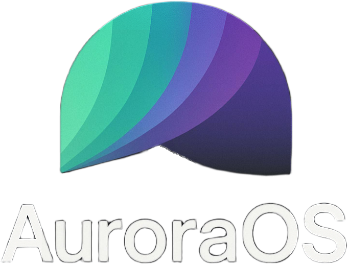

> **⚠ Warning**  This page is still under development!

## The AuroraOS Project.

What is the AuroraOS project? When did it start and by who?

## Techinal details

**Memory Layout** 
| Section                | Address Range       | Description |
|------------------------|--------------------|-------------|
| Bootloader            | `0x0000 - 0x3000`   | Initializes segment registers and stack. |
| Kernel Loading        | `0x1000+`           | Loads kernel into memory. |
| Video Framebuffer     | `FB_ADDR (BIOS)`    | Stores pixel data for display. |
| Heap Region           | `0x140000 - 0x540000` | Dynamic memory allocation. |
| Kernel Execution      | `0x10000+`          | Protected mode kernel execution. |

---

# History

> To find more about the history of AuroraOS, please visit the [history page](https://github.com/Wickslynx/AuroraOS/tree/main/docs/history.md)
