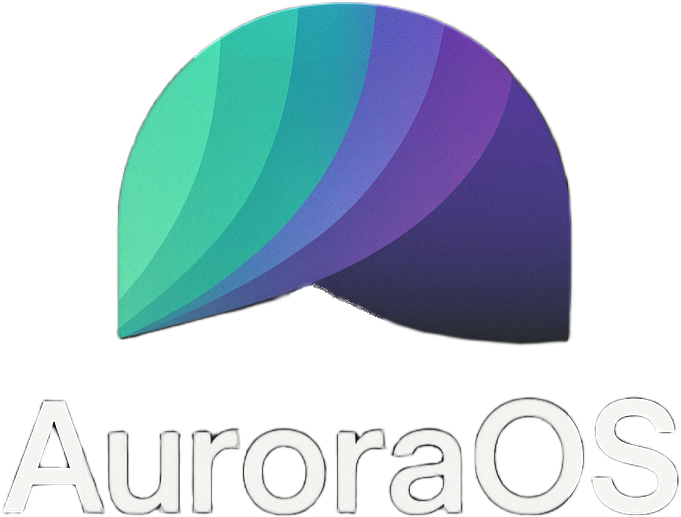

<p align="center">

</p>

> **⚠ Warning**<br> This page is still under development!

## Skill doesn't matter, or does it?
Do you really need to be a rocket scientist to contribute to AuroraOS? I don't belive so. 

Here's some things you can do at any level:
- Translating AuroraOS into different languages.
- Taking screenshots for our documents.

<br>

Here's some things you can do if you know a bit about code:
- Documenting undocumented code in our drivers.
- Making small apps. (I appreciate all apps, even "Hello World" ones.)

<br>

Here's some things you can do if you know a lot about code:
- Designing frontend libraries, writing additional apps.
- Closing issues. 

<br>

Here's some things you can do if you know too much about code:
- Porting to different architectures.
- Working in the kernel, implementing new features as you like.

> **IMPORTANT!** <br> All contributions is appreciated.

<br>


## **Reading my codebase?**

<br>

## **How do I document?**

Rules:
- Always add documentation for every commit you make, if you do not document your pull-request will not be merged.

> And no... I'm to lazy to document all my files.
Example of proper file documentation:


```c
/*
 * Copyright (C) 2025 AuroraOS
 * Written by Wicks, 2024
 * Modified by Wicks, 2025
 */

#include "error.h"

/* 
Returns the division of two nums.
raises: (PANIC) Division by 0 is not allowed.. (When you divide something with 0...)
*/

int divide(int num1, int num2) {
    if (num1 < 0 || num2 < 0) {
        panic("Division by 0 is not allowed."); // TODO: Change this to a warning, gracefully handle it.
    }

    return num1 / num2; // NOTE: What if you don't provide two nums?
}

```
> **✉ Note** <br> Feel free to add documentation to functions which doesn't have it, even though they are not yours.


<br>

## Techinal details


**File layout:**

**`.github/`**
Github related files!
- `workflows/`: github actions.

**`docs/`**
Documentation..
- `assets/images/`: Images
- `bugs/`: known issues, bugs...
- `kernel/`: kernel documentation.
- `tests/`: unit tests.
- `ui/`:
  - `vbe/`: VBE docs.
  - `vga/`: VGA docs.

**`kernel/`**
kernel source
- `boot/`: Bootloader-related code.
- `core/`: Kernel core logic initilazation, processes-
- `drivers/`: Hardware drivers 
- `fs/`: File system 
- `include/`: Header files f
- `mem/`: Memory management (paging, heap) 
- `tools/`: utilites (debug terminal..)
- `ui/`: auro UI library.
  - `system/`: system level ui.


**`meta/`**
(empty) metadata, configs...


**`user/`**
user space programs.
- `apps/`: Applications built for the OS.
  - `calculator/`: A calculator app.
  - `settings/`: A settings app.
  - `terminal/`: cmd line shell.
- `base-files/`: fs skeleton.
  - `etc/`: config files.
  - `tmp/`: Temporary directory.
  - `usr/`: user binaries.
  - `var/`:
    - `log/`: logs.
- `home/`: 

---


**Memory Layout** 
| Section                | Address Range       | Description |
|------------------------|--------------------|-------------|
| Bootloader            | `0x0000 - 0x3000`   | Initializes segment registers and stack. |
| Kernel Loading        | `0x1000+`           | Loads kernel into memory. |
| Video Framebuffer     | `FB_ADDR (BIOS)`    | Stores pixel data for display. |
| Heap Region           | `0x140000 - 0x540000` | Dynamic memory allocation. |
| Kernel Execution      | `0x10000+`          | Protected mode kernel execution. |

---

