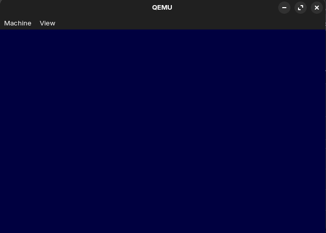
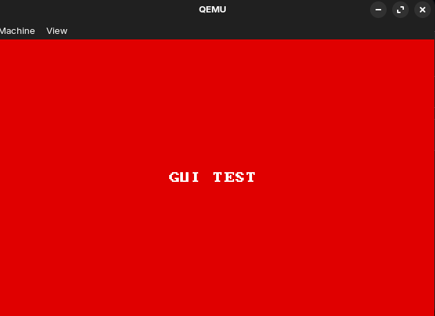
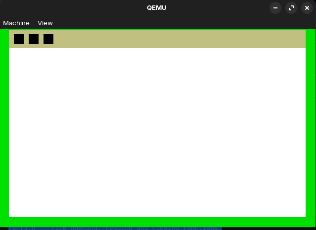
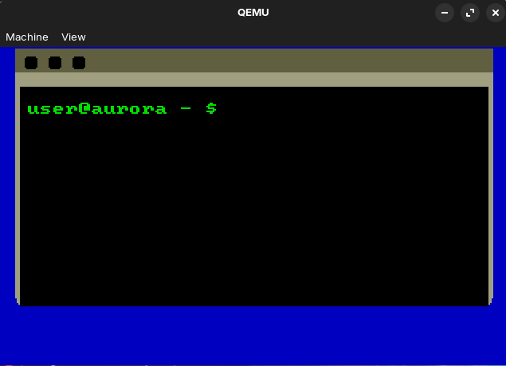
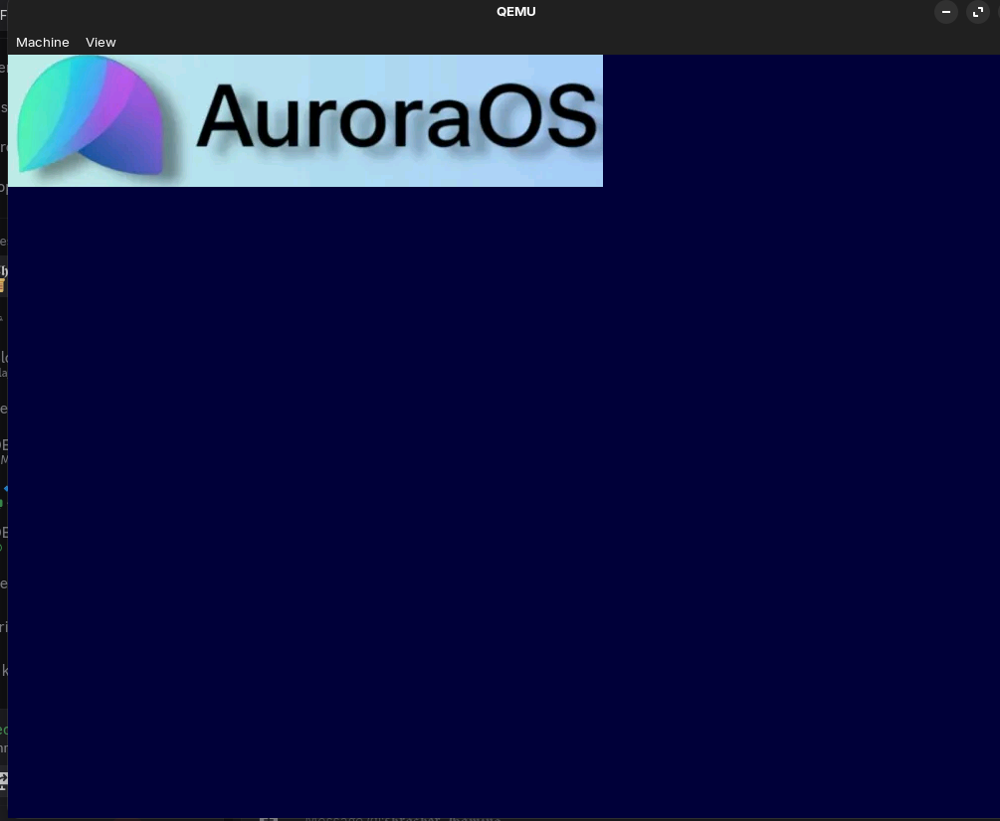

 
> **⚠ Warning**  This page is still under development!
 

The Journey of AuroraOS
 
# Late 2024 — November & December

This was the beginning of AuroraOS. I had never done any OS development before, so I relied on AI to help me create a simple bootloader that just displayed:
"Booting AuroraOS..."
This early version of the bootloader and kernel didn’t last long — it was quickly scrapped.
 
# A Few Months Later...

During Christmas, AuroraOS was put on hold. Honestly, I gave up for a while because it felt "too hard."
But after a few months, I got inspired again — this time by a video on Tetris OS. It gave me fresh ideas, and soon enough... I had a blue screen!

 
# Basic GUI Elements Appear...

I started experimenting with font rendering (borrowed from Tetris OS) and other simple graphical features. Here's another screen from that stage:

  

# A Better UI System...

Next, I played around with UI elements like windows and a terminal. Progress was slow and experimental — nothing very meaningful yet, but it was a start.

 

# Processes, Filesystem, and a New Build System...

For the following month, I focused on the "behind-the-scenes" work: processes, file handling, and setting up a new build system. Not much visible progress, but important foundations were laid.
 

# Image Rendering (Current State)

Just a few days ago, I successfully rendered my first image!
It wasn’t planned, and honestly not super useful yet — I was just getting tired of backend work and wanted to try something fun.

